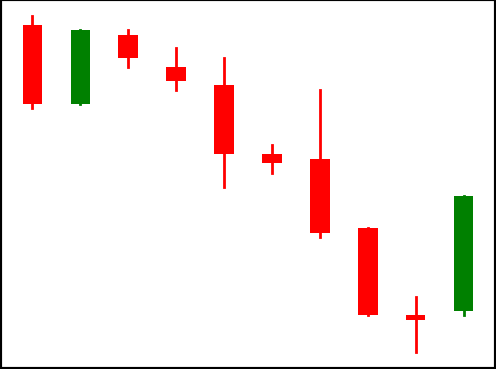

<!DOCTYPE html>
<html lang="en">
<head>
  <meta charset="UTF-8">
</head>
<body>
  <h1>Candlestick patterns classification using an attention based convolutional neural networks</h1>
  <h2> Abstract</h2>
  
Traders commonly rely on candlestick patterns as a crucial tool for determining
optimal entry and exit points. Thomas Bulkowski’s Encyclopedia of Candlestick
Charts lists 103 such patterns, and our focus is on 8 of them that are mentioned
in the candlestick patterns subsection. To classify these patterns using deep
learning, we propose a novel approach: creating a new feature set based on
the Opening, High, Low, and Closing (OHLC) dataset and utilizing Gramian
Angular Field (GAF) as an image encoder, followed by the incorporation of an
Attention mechanism module before employing a Convolutional Neural Network
(CNN) module. In our experiments, our method achieved an average accuracy
of 93.24% and 98.13% in automatically identifying eight types of candlestick
patterns with noisy class and without noisy class across real-world data,
 respectively, in an average of 20 iterations. This performance surpassed that of the
existing GAF-CNN model.

  
  <h2>Table of Contents</h2>
  <ul>
    <li><a href="#Requirements">Requirements</a></li>
    <li><a href="#Dataset">Dataset</a></li>
	<li><a href="#Implementation">Implementation</a></li>
	<li><a href="#Citation">Citation</a></li>
  </ul>
  
  <h2 id="Requirements">Requirements</h2>
  
The requirements are provided in the requirements.txt file.

  
  <h2 id="Dataset">Dataset</h2>
   
We utilized the existing dataset available at https://github.com/pecu/FinancialVision.
      This dataset consists of EUR/USD 1-minute price data spanning from January 1, 2010, to January 1, 2018,
      within our real-world data framework. It comprises 1500 instances for training for each class, 200 for
      validation for each class, and 500 for testing for each class. Notably, we included twice as much data
      in the training set for class 0, representing noisy data for other classes. Since we want our test data
      to be the same as the existing results compared in the main article, we chose 1000 instances for training
      for each class, 200 for validation for each class, and 350 for testing, and created OHLC, CULR, and CCOMHML,
      loading them into the data folder. For more information, please see the main article.

	  
	  
The patterns that we utilized in our experiments were Evening Star, Morning Star, Bearish Engulfing,
	  Bullish Engulfing, Shooting Star, Inverted Hammer, Bearish Harami, and Bullish Harami, labeled as 1 and 8
	  respectively, with 0 for the noisy class in our datasets.

		
  <figure>
    
    <figcaption>Evening Star</figcaption>
  </figure>
  <figure>
    
    <figcaption>Bearish Engulfing</figcaption>
  </figure>
  <figure>
    
    <figcaption>Bearish Harami</figcaption>
  </figure>
  <figure>
    
    <figcaption>Shooting Star</figcaption>
  </figure>
  <figure>
    
    <figcaption>Morning Star</figcaption>
  </figure>
  <figure>
    
    <figcaption>Bullish Engulfing</figcaption>
  </figure>
  <figure>
    
    <figcaption>Bullish Harami</figcaption>
  </figure>
  <figure>
    
    <figcaption>Inverted Hammer</figcaption>
  </figure>

	   
  <h2 id="Implementation">Implementation</h2>
  

  Our dataset is like the following dictionary. You can choose one of the dataset paths existing in the train_model.py file or
  create your own dataset and train a model. Please note that if your dataset has a noisy class, set the 'label_num' parameter
  as 9. If your dataset does not have a noisy class, set it as 8.
  

	<pre class="dict">
dataset = {
    'train': {
        'data': {{ data['train']['data'] }},
        'gaf': {{ data['train']['gaf'] }},
        'label_arr': {{ data['train']['label_arr'] }},
        'label': {{ data['train']['label'] }}
    },
    'test': {
        'data': {{ data['test']['data'] }},
        'gaf': {{ data['test']['gaf'] }},
        'label_arr': {{ data['test']['label_arr'] }},
        'label': {{ data['test']['label'] }}
    },
    'val': {
        'data': {{ data['val']['data'] }},
        'gaf': {{ data['val']['gaf'] }},
        'label_arr': {{ data['val']['label_arr'] }},
        'label': {{ data['val']['label'] }}
    }
}
</pre>

  <h2 id="Citation">Citation</h2> 
	To cite this study:
<pre>
@article{acnn2024,
  title={Candlestick patterns classification using an attention based convolutional neural networks},
  author={Hashem, Ezzati and Mohammad Hassan, Shirali-Shahreza and Erfan, Salavati},
  journal={},
  year={2024}
}
</pre>
  </body>
  </html>
